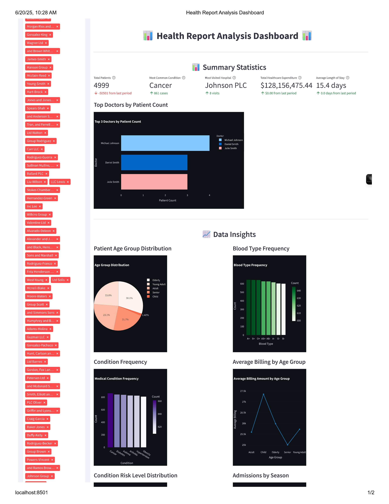
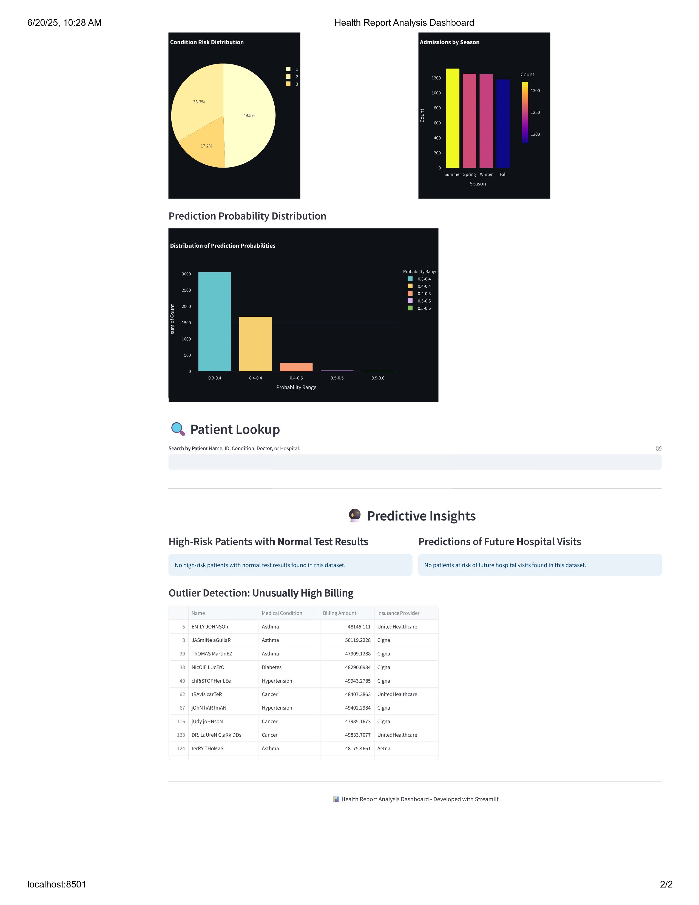

Creating a README file for your GitHub project is a great way to provide an overview of your project, its features, and how to use it. Below is a detailed README file for your Health Report Analysis Dashboard project. I'll also include placeholders for the images you mentioned.

### README.md

```markdown
# Health Report Analysis Dashboard

A web-based dashboard for analyzing and visualizing health report data. This dashboard allows healthcare professionals to quickly search for patient records, view detailed information, and gain insights through interactive visualizations.

## Features

- **Interactive Patient Search**: Search for patients by name, ID, medical condition, doctor, or hospital.
- **Detailed Patient Information**: View comprehensive patient details including personal information, medical history, hospitalization data, and billing information.
- **Risk Alert System**: Highlight patients with high-risk conditions.
- **Billing Comparison Visualization**: Compare billing amounts for patients with similar conditions.
- **Custom Styling and Layout**: Clean and modern design with custom CSS for improved user experience.

## Getting Started

### Prerequisites

- Python 3.8 or higher
- Streamlit
- Plotly
- Pandas

### Installation

1. Clone the repository:

   ```bash
   git clone https://github.com/yourusername/health-report-dashboard.git
   ```

2. Install the required packages:

   ```bash
   pip install streamlit plotly pandas
   ```

3. Run the dashboard:

   ```bash
   streamlit run health_dashboard.py
   ```

### Usage

1. Open your web browser and navigate to the local Streamlit URL (usually `http://localhost:8501`).
2. Use the search bar to find patients by name, ID, condition, doctor, or hospital.
3. Select a patient from the search results to view detailed information.
4. Explore the interactive visualizations to gain insights into patient data.

## Screenshots




## Contributing

Feel free to contribute to this project by submitting pull requests or opening issues. Any contributions are welcome!

## License

This project is licensed under the MIT License - see the [LICENSE](LICENSE) file for details.

## Contact

For any questions or feedback, please contact [your-email@example.com](mailto:your-email@example.com).

## Acknowledgments

- [Streamlit](https://streamlit.io/) for providing a powerful and easy-to-use framework for creating web applications.
- [Plotly](https://plotly.com/) for enabling interactive data visualizations.
- [Pandas](https://pandas.pydata.org/) for efficient data manipulation and analysis.
```

### Adding Images to Your GitHub Repository

To include the images in your GitHub repository, follow these steps:

1. **Upload the Images**: Place the images (`Web_page-0001.jpg` and `Web_page-0002.jpg`) in the root directory of your repository or in a specific folder (e.g., `images/`).

2. **Update the README File**: Ensure the paths to the images in the README file match the actual paths in your repository. If you place the images in an `images/` folder, update the paths accordingly:

   ```markdown
   
   
   ```

3. **Commit and Push**: Commit the changes to your repository and push them to GitHub.

   ```bash
   git add README.md Web_page-0001.jpg Web_page-0002.jpg
   git commit -m "Add README and dashboard screenshots"
   git push origin main
   ```

This README file provides a comprehensive overview of your project, its features, and how to use it. The images will visually demonstrate the dashboard's interface, giving users a clear idea of what to expect.
